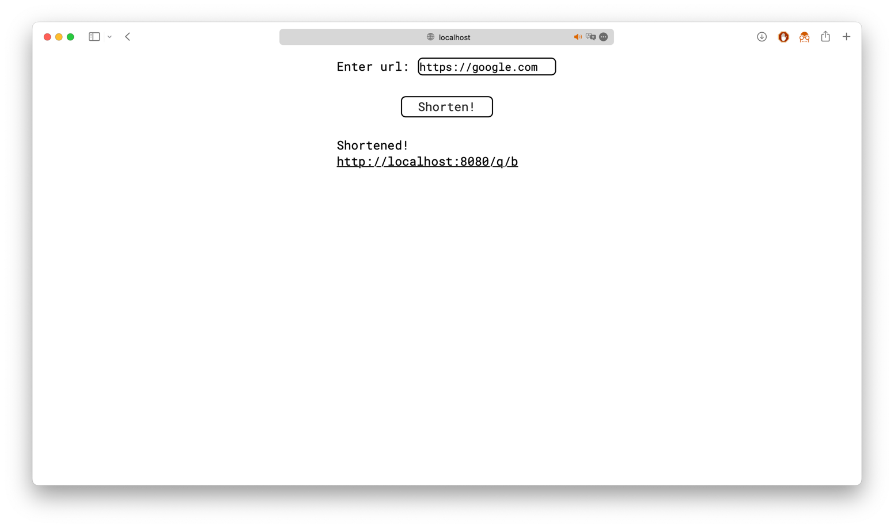
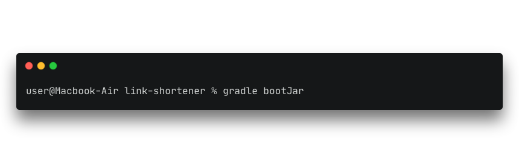
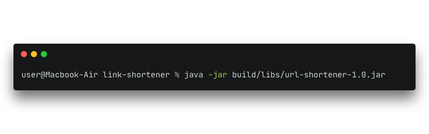
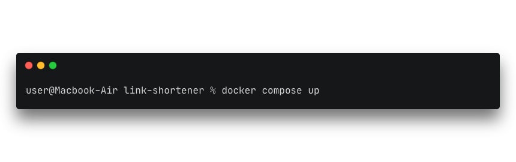

---
### What is it?
Link-shortener is webapp that can make links short

### Screenshots


### How to run
- Change server-url in application.properties
#### First way:
Prerequisites:
- Java 17 or higher
- Gradle
- Postgres (default address is ```db:5432/url_shortener```, change in ```application.properties``` to database address)

Steps:
1. 
2. 

Done!

#### Second way (Docker):
Prerequisites:
- Java 17 or higher
- Gradle
- Docker

Steps:
1. 
2. 

Done!

### Technologies:
- Spring Boot
- Spring Web
- Spring Data
- Thymeleaf
- Postgres

### From author
I like this project 